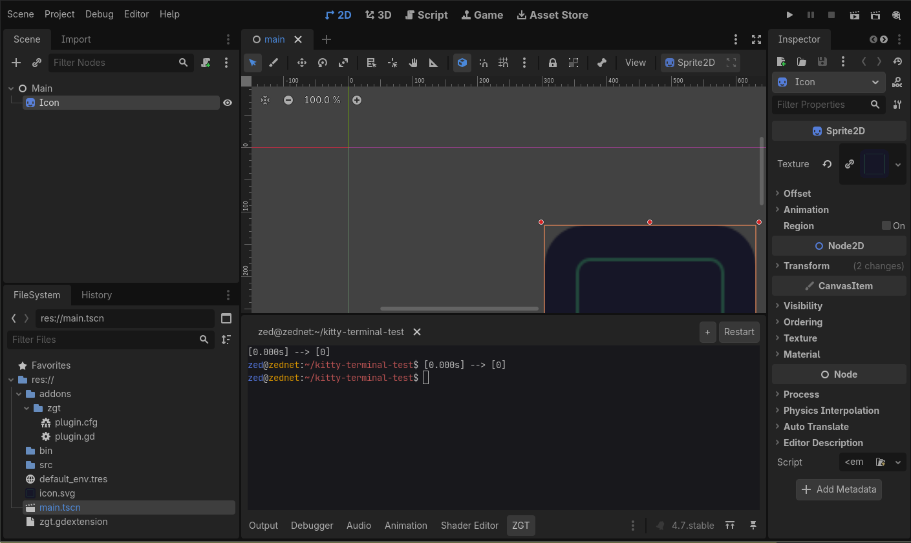
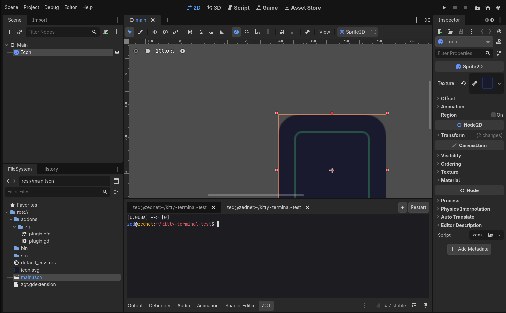
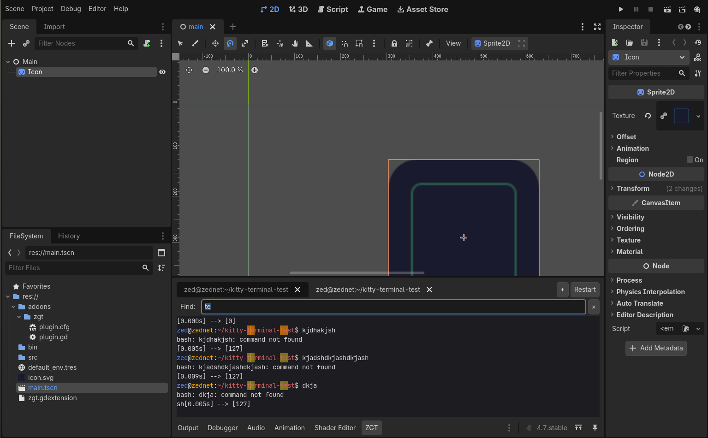
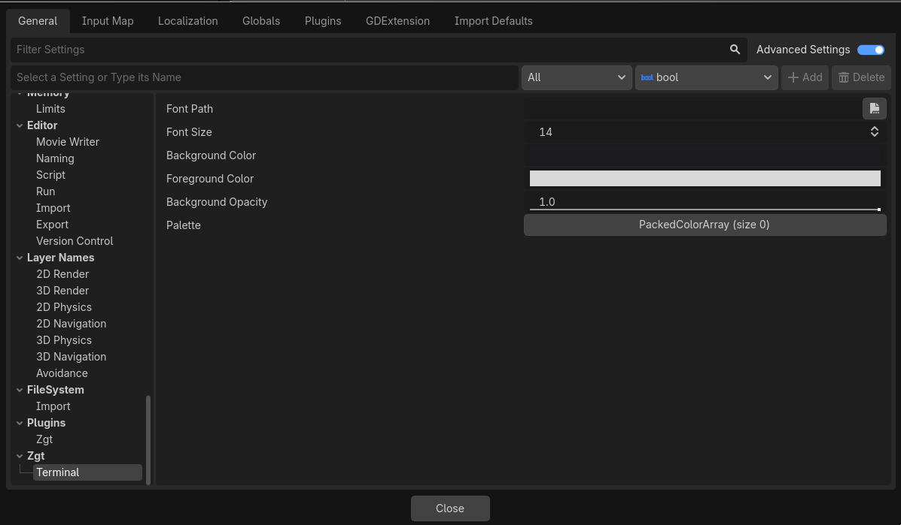

# ZGT — ZeDs Godot Terminal (source)

A Godot 4 GDExtension (C++) that adds a real, built-in terminal to the editor's bottom panel. It runs your shell (`$SHELL`) on a pseudoterminal and renders the character grid itself, so it works identically on **X11 and Wayland**. Good enough to run full TUIs like `claude`, `nvim`, `htop` and `lazygit`.

 



> Prebuilt binaries and install instructions live in **[zgt-bin](https://github.com/zednaked/zgt-bin)** — start there if you just want to use it.

It began as a Kitty-window-embedding hack, reparenting an X11 terminal into the
editor. That falls apart on Wayland: XWayland clients can't position their own
windows. So the embedding was thrown out for a self-contained PTY terminal that
renders its own grid — which is why it behaves the same under X11 and Wayland,
and why nothing here touches either API.

| Tabs | Scrollback search | Configuration |
|---|---|---|
|  |  |  |

## Features

- Real PTY shell (`forkpty` + `$SHELL -i`), starts in the project root (`res://`)
- Practical VT/ANSI parser: cursor/erase/scroll-region, SGR (16/256/**truecolor**), alt-screen, bracketed paste, DSR/DA replies (fish-compatible)
- **Multiple terminals in tabs**, each with its OSC window title
- **Mouse tracking** (`?1000/1002/1003` + SGR `?1006`), Shift = local selection
- **Scrollback search** (`Ctrl+Shift+F`), **smart selection** (double=word, triple=line), **Ctrl+click URLs**
- **Configurable** font / size / colors / 16-color palette (Project Settings), live font zoom
- Cursor shapes (DECSCUSR), OSC 52 clipboard, focus reporting

## Build

```bash
./setup.sh                                      # clone godot-cpp (4.3 branch), one-time
scons platform=linux                            # -> bin/libzgt.linux.template_debug.x86_64.so
scons platform=linux target=template_release    # release build
```

Then drop the `.so` into a project's `bin/` next to `zgt.gdextension`, enable the **ZeDs Godot Terminal** plugin, and open the **ZGT** bottom-panel tab. See [`docs/ARCHITECTURE.md`](docs/ARCHITECTURE.md) for how it works inside.

A test project lives in [`demo/`](demo/).

## Scope

Linux only, and that is not a temporary state — the native layer is built on
`forkpty` and POSIX signals.

Bug reports are welcome, especially anything that misrenders. Feature requests
will likely sit: this is a tool I maintain because I use it every day, not a
product with a roadmap. Patches are a faster path than issues.

## License

MIT — see [LICENSE](LICENSE).
